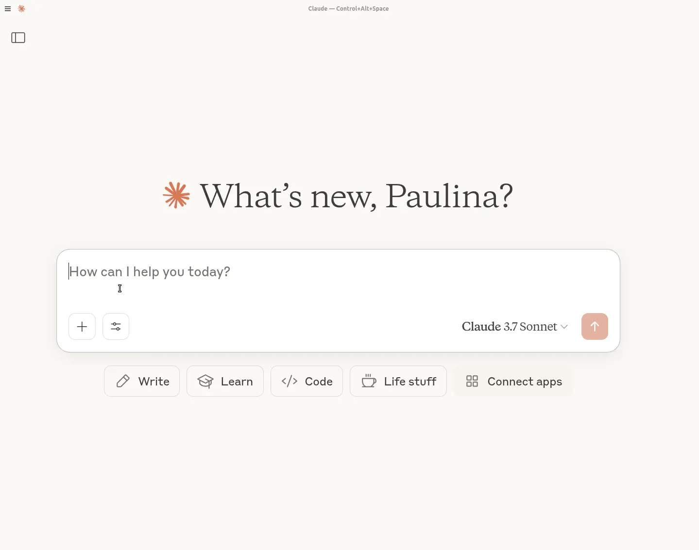

<p align="center">

</p>

<p align="center">
  <a href="https://opensource.org/licenses/MIT">
    
  <a href="https://www.groundlight.ai/blog/vision-as-mcp-service">
    
  </a>
</p>
  </a>
</p>

# mcp-vision by 

A Model Context Protocol (MCP) server exposing HuggingFace computer vision models such as zero-shot object detection as tools, enhancing the vision capabilities of large language or vision-language models.

This repo is in active development. See below for details of currently available tools.

## Installation

Clone the repo:
```bash
git clone git@github.com:groundlight/mcp-vision.git
```

Build a local docker image:
```bash
cd mcp-vision
make build-docker
```

## Configuring Claude Desktop

Add this to your `claude_desktop_config.json`:

If your local environment has access to a NVIDIA GPU:
```json
"mcpServers": {
  "mcp-vision": {
    "command": "docker",
    "args": ["run", "-i", "--rm", "--runtime=nvidia", "--gpus", "all", "mcp-vision"],
	"env": {}
  }
}
```
Or, CPU only:
```json
"mcpServers": {
  "mcp-vision": {
    "command": "docker",
    "args": ["run", "-i", "--rm", "mcp-vision"],
	"env": {}
  }
}
```
When running on CPU, the default large-size object detection model make take a long time to laod and run inference. Consider using a smaller model as `DEFAULT_OBJDET_MODEL` (you can tell Claude directly to use a specific model too). 

**(Beta)** It is possible to run the public docker image directly without building locally, however the download time may interfere with Claude's loading of the server. 
```json
"mcpServers": {
  "mcp-vision": {
    "command": "docker",
    "args": ["run", "-i", "--rm", "--runtime=nvidia", "--gpus", "all", "utarn/mcp-vision:latest"],
	"env": {}
  }
}
```

## Tools
The following tools are currently available through the mcp-vision server:

1. **locate_objects**
- Description: Detect and locate objects in an image using one of the zero-shot object detection pipelines available
through HuggingFace (list for reference [https://huggingface.co/models?pipeline_tag=zero-shot-object-detection&sort=trending]).
- Input: `image_path` (string) URL or file path, `candidate_labels` (list of strings) list of possible objects to detect, `hf_model` (optional string), will use `"google/owlvit-large-patch14"` by default, which could be slow on a non-GPU machine
- Returns: List of dicts in HF object-detection format

2. **zoom_to_object**
- Description: Zoom into an object in the image, allowing you to analyze it more closely. Crop image to the object bounding box and return the cropped image. If many objects are present in the image, will return the 'best' one as represented by object score.
- Input: `image_path` (string) URL or file path, `label` (string) object label to find and zoom and crop to, `hf_model` (optional), will use `"google/owlvit-large-patch14"` by default, which could be slow on a non-GPU machine
- Returns: MCPImage or None

3. **read_text_from_image**
- Description: Extract text from images using EasyOCR with support for multiple languages including English and Thai
- Input: `image_path` (string) URL or file path, `languages` (optional list of language codes, default: ['en', 'th']), `min_confidence` (optional float, default: 0.0)
- Returns: Extracted text as string

4. **read_text_from_pdf**
- Description: Extract text from PDF files by converting each page to an image and using EasyOCR
- Input: `pdf_path` (string) URL or file path, `languages` (optional list of language codes, default: ['en', 'th']), `num_pages` (optional int, default: all pages), `min_confidence` (optional float, default: 0.0)
- Returns: Concatenated text from all processed pages


## Example in blog post and video

Run Claude Desktop with Claude Sonnet 3.7 and `mcp-vision` configured as an MCP server in `claude_desktop_config.json`. 

The prompt used in the example video and blog post was: 
```
From the information on that advertising board, what is the type of this shop?
Options:
The shop is a yoga studio.
The shop is a cafe.
The shop is a seven-eleven.
The shop is a milk tea shop.
```
The image is the first image in the V*Bench/GPT4V-hard dataset and can be found here: https://huggingface.co/datasets/craigwu/vstar_bench/blob/main/GPT4V-hard/0.JPG (use the download link). 

<p align="center">

</p>

Note: 
- If you upload the image directly into the conversation with Claude instead of providing a download link, it will not be able to call the tools and will attempt to answer directly. 
- On accounts that have web search enabled, Claude will prefer to use web search over local MCP tools AFAIK. Disable web search for best results. 

## Testing OCR Functionality

You can test the OCR functionality using the included test runner:

```bash
uv run test_runner.py
```

This will test:
- English text extraction from images and PDFs
- Thai language support with multiple confidence thresholds
- Combined English + Thai text recognition

### Thai Language Support

The OCR tools include enhanced support for Thai language text extraction:
- Uses EasyOCR with Thai language models
- Configurable confidence thresholds to handle low-confidence Thai text recognition
- Improved text extraction for both images and PDF documents
- Default confidence threshold of 0.0 to capture all recognized text including low-confidence Thai characters

## Development

Run locally using the <a href="https://github.com/astral-sh/uv">`uv`</a> package manager:
```bash
uv install
uv run python mcp_vision
```

Build the Docker image locally:
```bash
make build-docker
```

Run the Docker image locally:
```bash
make run-docker-cpu
```
or 
```bash
make run-docker-gpu
```

[Groundlight Internal] Push the Docker image to Docker Hub (requires DockerHub credentials):
```bash
make push-docker
```

## Troubleshooting

If Claude Desktop is failing to connect to `mcp-vision`:
- Check the configuration is correct (CPU vs GPU)
- Developer options may need to be enabled in Claude Desktop
- Depending on the size of the model(s) used, give it a few minutes to download them from HuggingFace on first opening Claude Desktop. Once downloaded, the server will respond and Claude will connect.

On accounts that have web search enabled, Claude will prefer to use web search over local MCP tools AFAIK. Disable web search for best results. 

## TODO
- Host best models online instead of requiring local download
- Add more tools

